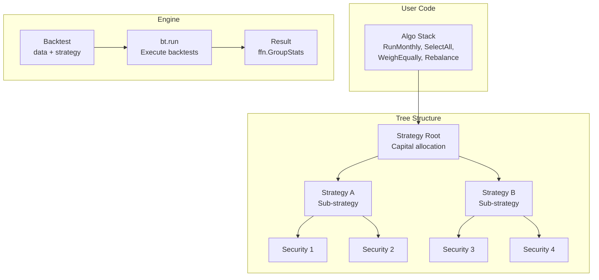

# bt -- Flexible Backtesting Framework

> **Last Updated**: 2026-04-06T16:25:30Z  \
> **Git Hash**: `ebe814b`

**Flexible backtesting for testing quantitative trading strategies**

- **Repository**: [github.com/pmorissette/bt](https://github.com/pmorissette/bt)
- **Documentation**: [pmorissette.github.io/bt](http://pmorissette.github.io/bt)
- **License**: MIT
- **Language**: Python 3.9+ (optional Cython optimization)
- **Dependencies**: ffn, pandas, numpy, pyprind, tqdm, matplotlib, scikit-learn

## Overview

bt is a flexible backtesting framework for Python that emphasizes modularity, composability, and reusability. It uses a tree-based strategy composition model where strategies are nodes that allocate capital to children (other strategies or securities). Trading logic is defined as composable "Algo" building blocks that form algorithm stacks. This design enables rapid prototyping of complex hierarchical portfolio strategies, from simple buy-and-hold to multi-level allocation schemes with nested sub-strategies.

## Key Features

| Category | Features |
|----------|----------|
| **Strategy Model** | Tree-based hierarchical composition, strategies contain strategies or securities |
| **Algo System** | 50+ built-in algos: selection, weighting, rebalancing, timing, risk management |
| **Weighting** | Equal weight, inverse volatility, mean-variance, risk parity, specified weights |
| **Selection** | All, top N performers, momentum, random, threshold-based |
| **Timing** | RunDaily, RunWeekly, RunMonthly, RunQuarterly, RunYearly, RunOnDate, RunEveryNPeriods |
| **Rebalancing** | Automatic rebalancing with tolerance bands (RunIfOutOfBounds) |
| **Results** | Built on ffn: Sharpe, CAGR, drawdown, monthly returns, interactive plotting |
| **Fixed Income** | Notional weighting, coupon payments, hedging securities |
| **Performance** | Optional Cython compilation (2-5x speedup on core.py) |
| **Random Benchmark** | Statistical testing via `benchmark_random()` |

## Quick Start

Run an equal-weight rebalancing strategy with random price data -- no external files or API keys required:

```python
import bt
import pandas as pd
import numpy as np

# Generate random price data
np.random.seed(42)
dates = pd.date_range("2020-01-01", periods=252, freq="B")
prices = pd.DataFrame({
    "Asset_A": 100 * np.cumprod(1 + np.random.randn(252) * 0.01),
    "Asset_B": 50 * np.cumprod(1 + np.random.randn(252) * 0.015),
    "Asset_C": 200 * np.cumprod(1 + np.random.randn(252) * 0.008),
}, index=dates)

# Define strategy: rebalance monthly to equal weights
strategy = bt.Strategy("EqualWeight", [
    bt.algos.RunMonthly(),
    bt.algos.SelectAll(),
    bt.algos.WeighEqually(),
    bt.algos.Rebalance(),
])

# Run backtest
backtest = bt.Backtest(strategy, prices, initial_capital=100000)
result = bt.run(backtest)
result.display()
```

## Architecture Summary



The framework's key insight is separating **what** to trade (selection algos), **how much** to allocate (weighting algos), and **when** to act (timing algos) into composable building blocks.

## Core Components

| Component | Source File | Description |
|-----------|------------|-------------|
| `Node` | `core.py` | Base tree node with price/value/weight tracking and child management |
| `StrategyBase` | `core.py` | Strategy node with capital allocation, position tracking, commission support |
| `Strategy` | `core.py` | StrategyBase + AlgoStack for defining trading logic |
| `SecurityBase` | `core.py` | Leaf node representing a tradeable asset with position tracking |
| `Security` | `core.py` | Standard equity security |
| `FixedIncomeStrategy` | `core.py` | Strategy using notional-value weighting |
| `FixedIncomeSecurity` | `core.py` | Fixed income instrument with coupon support |
| `Algo` | `core.py` | Base class for modular strategy logic blocks |
| `AlgoStack` | `core.py` | Sequential chain of Algos (stops on first False) |
| `Backtest` | `backtest.py` | Combines strategy with data; runs simulation |
| `Result` | `backtest.py` | Extends ffn.GroupStats with backtest-specific analysis |
| `algos.*` | `algos.py` | 50+ built-in algos for selection, weighting, timing, rebalancing |

## Built-in Algos Overview

| Category | Key Algos |
|----------|-----------|
| **Timing** | `RunDaily`, `RunWeekly`, `RunMonthly`, `RunQuarterly`, `RunYearly`, `RunOnDate`, `RunEveryNPeriods`, `RunAfterDate`, `RunAfterDays` |
| **Selection** | `SelectAll`, `SelectThese`, `SelectN`, `SelectMomentum`, `SelectWhere`, `SelectHasData`, `SelectRandomly` |
| **Weighting** | `WeighEqually`, `WeighSpecified`, `WeighInvVol`, `WeighMeanVar`, `WeighERC`, `WeighTarget`, `WeighRandomly` |
| **Allocation** | `Rebalance`, `RebalanceOverTime` |
| **Risk** | `LimitDeltas`, `LimitWeights`, `RunIfOutOfBounds` |
| **Utility** | `PrintDate`, `PrintInfo`, `Debug`, `Or`, `Not`, `SetStat` |

## Documentation

- [Architecture](architecture.md) -- Tree structure, algo system, data flow diagrams
- [Workflow](workflow.md) -- Backtesting pipeline, strategy execution, algo stack processing
- [State Management](state-management.md) -- Node state, position tracking, capital allocation
- [Development](development.md) -- Setup, strategy creation, custom algos, data integration
