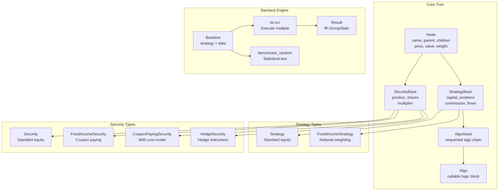
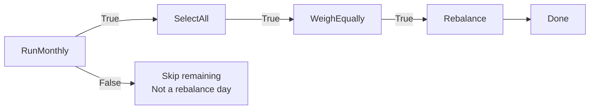
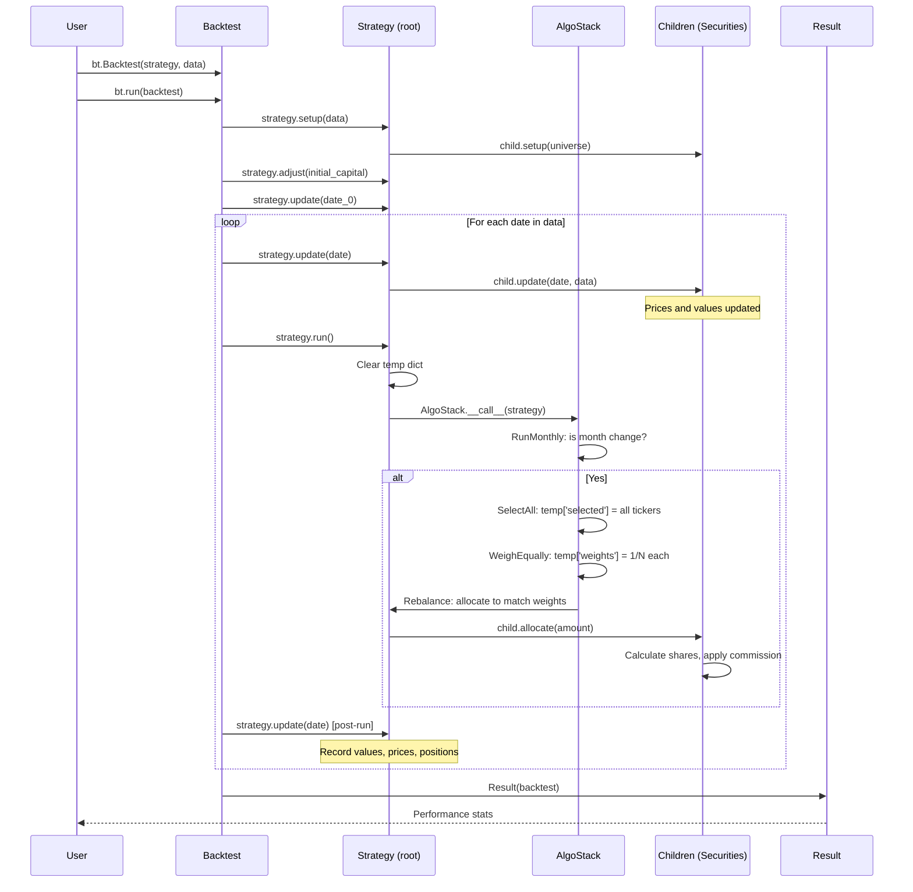
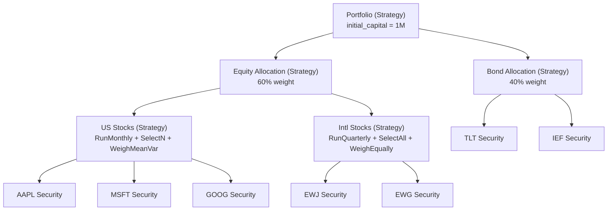

# bt -- Architecture

## System Architecture



## Trading Paradigm & Key Features

| Feature | Support | Details |
|---------|---------|---------|
| Backtesting Approach | Event-driven | Tree-based strategy composition with algo stacks; bar-by-bar update loop |
| Live Trading | No | Backtesting only; no broker connectivity |
| Paper Trading | Yes | Sub-strategies use automatic paper trading for independent performance tracking |
| Multi-Asset | Yes | Natively multi-asset via tree structure; strategies hold multiple securities as children |
| Data Feeds | pandas DataFrame | Price DataFrames with DatetimeIndex; additional data (bid/offer, coupons) via kwargs |
| ML Integration | No | No built-in ML; custom algos can wrap ML predictions via the `Algo` interface |
| Risk Management | Custom | Modular risk via algos: `LimitWeights`, `LimitDeltas`, `TargetVol`, `UpdateRisk`, `HedgeRisks` |
| Optimization | Limited | `benchmark_random()` for statistical validation against random strategies; no built-in grid search |
| Execution | Simulated | Internal capital allocation with commission functions; supports integer and fractional positions |

## Core Components Breakdown

### Node (`core.py:24-331`)

The base building block of bt's tree structure. Every strategy and security inherits from Node.

**Key properties:**
- `name`, `parent`, `root`, `children` -- tree relationships
- `price`, `value`, `notional_value`, `weight` -- financial state
- `now` -- current simulation date
- `stale` -- flag triggering lazy recomputation

**Key behavior:**
- Children can be added as Node objects, or as strings (lazy creation as Security)
- The root node tracks global stale state; any child access triggers update propagation
- `integer_positions` flag controls whether share quantities are rounded

### StrategyBase (`core.py:333-1149`)

Extends Node with capital allocation and position management:

- **Capital tracking**: `capital` (unallocated cash), `value` (total portfolio value), `prices` (index series)
- **Position management**: `allocate()`, `rebalance()`, `close()`, `flatten()`
- **Commission**: `commission_fn(quantity, price)` applied to all trades
- **Flows**: Tracks cash inflows/outflows separately from returns
- **Bid/offer**: Optional transaction cost modeling via `bidoffer` data

**State series (per date):**
- `_prices`, `_values`, `_notl_values` -- price/value time series
- `_cash`, `_fees`, `_all_flows` -- cash, fees, flows time series
- `_positions` -- DataFrame of positions per security

### SecurityBase (`core.py:1150-1727`)

Leaf nodes representing tradeable assets:

- **Position tracking**: `_position` (current shares), `_value` (market value)
- **Price source**: Reads from universe DataFrame column matching its name
- **Allocation**: `allocate(amount)` calculates shares to buy/sell, applies commission
- **Update**: Recalculates value from current price and position

### Algo (`core.py:1985-2019`)

The modular logic building block:

```python
class Algo(object):
    def __call__(self, target):
        raise NotImplementedError()
```

Each Algo receives the target strategy and returns `True` (continue) or `False` (stop stack).

Communication between algos happens via two dictionaries on the target:
- **`temp`**: Cleared before each `run()` call. Keys like `selected`, `weights`.
- **`perm`**: Persists across runs. For stateful algos.

### AlgoStack (`core.py:2020-2058`)

Chains Algos sequentially. Execution stops when any Algo returns `False`, unless marked with `@run_always`.



### Strategy = StrategyBase + AlgoStack (`core.py:2060-2108`)

The `Strategy` class combines tree-based capital management with algo-based logic:

```python
class Strategy(StrategyBase):
    def __init__(self, name, algos=None, children=None):
        super().__init__(name, children=children)
        self._algos = AlgoStack(*algos) if algos else AlgoStack()
```

## Component Interaction Diagram



## Data Flow Diagram

```mermaid
flowchart LR
    subgraph Input
        PRICES[Price DataFrame<br/>DatetimeIndex<br/>columns = tickers]
        ADDL[Additional Data<br/>bidoffer, coupons,<br/>cost_long, cost_short]
    end

    subgraph Setup
        PRICES --> UNIVERSE[Strategy Universe<br/>Available at each date]
        ADDL --> EXTRA[Accessible via<br/>strategy.get_data]
    end

    subgraph Algo Pipeline
        UNIVERSE --> SELECT[Selection Algos<br/>SelectAll, SelectN,<br/>SelectMomentum]
        SELECT --> WEIGH[Weighting Algos<br/>WeighEqually,<br/>WeighInvVol, WeighMeanVar]
        WEIGH --> REBAL[Rebalance Algo<br/>Target vs Current weights]
    end

    subgraph Execution
        REBAL --> ALLOC[Capital Allocation<br/>Per security]
        ALLOC --> SHARES[Share Calculation<br/>amount / price]
        SHARES --> COMM[Commission Applied<br/>commission_fn qty price]
        COMM --> POS[Position Updated]
    end

    subgraph Output
        POS --> VALUES[Strategy Values<br/>Prices series index]
        VALUES --> FFN[ffn.PerformanceStats]
        FFN --> STATS[Sharpe, CAGR, MaxDD<br/>Monthly returns]
        FFN --> PLOTS[Matplotlib Charts]
    end
```



## Tree Structure Design

bt's most distinctive feature is hierarchical strategy composition:



Each strategy node independently:
- Runs its own algo stack on its own schedule
- Manages its own capital pool
- Tracks its own performance (prices, values)
- Can have different rebalancing frequencies

## Cython Integration

`core.py` uses Cython annotations for performance:

```python
@cy.locals(x=cy.double)
def is_zero(x):
    return abs(x) < TOL
```

Build flow:
1. Cython available: compile `core.py` to `core.so` (2-5x speedup)
2. Cython unavailable: use pre-built `core.c` via C compiler
3. Neither available: fall back to pure Python (no performance penalty on correctness)

---
## See Also
- [README](README.md) — Project overview and quick start
- [Workflow](workflow.md) — Event flows and processing pipelines
- [State Management](state-management.md) — State lifecycle and data models
- [Development](development.md) — Development guide and best practices
