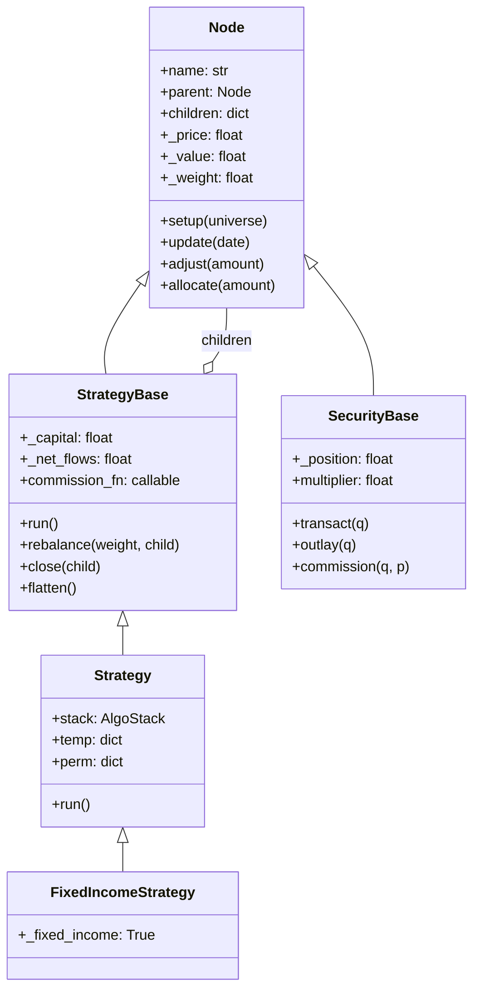
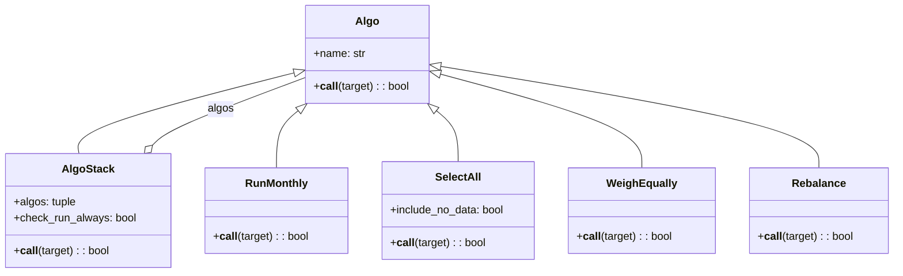
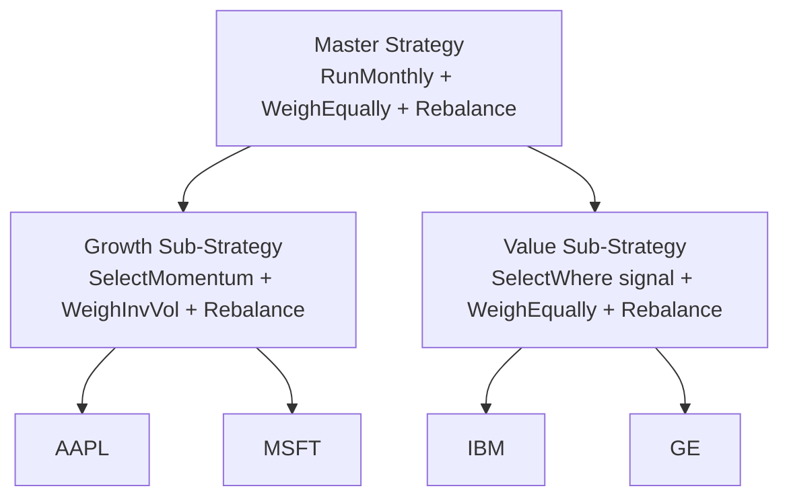

# bt -- Development Guide

## Overview

This guide covers the design patterns used in bt, best practices for extending
the framework, and practical examples of writing custom algos and strategies.

---

## 1. Design Patterns

### 1.1 Composite Pattern (Tree Structure)

bt's core architecture is built on the Composite pattern. `Node` is the base
component, with `StrategyBase` acting as the composite (can contain children)
and `SecurityBase` acting as the leaf.



This pattern enables:
- Uniform interface for strategies and securities (`update()`, `allocate()`)
- Recursive operations (setup, update propagate through the tree)
- Strategy-of-strategies composition for complex portfolio hierarchies

### 1.2 Strategy Pattern (Algos)

Each `Algo` encapsulates a single piece of strategy logic. The `AlgoStack`
acts as the context that runs algos in sequence. This follows the unix philosophy:
each algo does one thing well.



### 1.3 Template Method Pattern (RunPeriod)

The `RunPeriod` base class (`algos.py`, line 134) implements the scheduling logic
template, delegating the date comparison to subclasses:

```python
class RunPeriod(Algo):
    def __call__(self, target):
        # ... common boundary checking logic ...
        result = self.compare_dates(now, date_to_compare)
        return result

    @abc.abstractmethod
    def compare_dates(self, now, date_to_compare):
        raise NotImplementedError()
```

Subclasses: `RunDaily`, `RunWeekly`, `RunMonthly`, `RunQuarterly`, `RunYearly`

### 1.4 Chain of Responsibility (AlgoStack)

The `AlgoStack` implements a chain where each algo can halt execution by
returning `False`. The `run_always` decorator modifies this behavior for
specific algos that must execute regardless of prior failures (e.g.,
`RebalanceOverTime` needs to track its internal state on every call).

---

## 2. Writing Custom Algos

### 2.1 Basic Algo Template

Every algo is a callable that receives a `target` (the strategy) and returns
a boolean. Return `True` to continue the stack, `False` to halt.

```python
import bt

class MyCustomAlgo(bt.Algo):
    """
    Description of what this algo does.

    Args:
        * param1 (type): Description

    Sets:
        * temp_key

    Requires:
        * other_temp_key
    """

    def __init__(self, param1):
        super().__init__()
        self.param1 = param1

    def __call__(self, target):
        # Access current date
        now = target.now

        # Access universe data
        prices = target.universe.loc[now]

        # Read from temp (set by earlier algos)
        selected = target.temp.get('selected', [])

        # Do computation
        result = self._compute(prices, selected)

        # Write to temp (for later algos)
        target.temp['my_result'] = result

        return True  # continue stack

    def _compute(self, prices, selected):
        # Your logic here
        pass
```

### 2.2 Example: Volatility Filter Algo

```python
import numpy as np
import pandas as pd
import bt

class SelectLowVol(bt.Algo):
    """
    Filters temp['selected'] to securities with annualized vol below threshold.

    Args:
        * lookback (DateOffset): Period for volatility estimation
        * threshold (float): Maximum annualized volatility (e.g., 0.30)

    Sets:  selected    Requires:  selected
    """

    def __init__(self, lookback=pd.DateOffset(months=3), threshold=0.30):
        super().__init__()
        self.lookback = lookback
        self.threshold = threshold

    def __call__(self, target):
        selected = target.temp.get('selected', [])
        if not selected:
            return False
        prices = target.universe.loc[target.now - self.lookback:target.now, selected]
        vol = prices.pct_change().dropna().std() * np.sqrt(252)
        low_vol = vol[vol < self.threshold].index.tolist()
        target.temp['selected'] = low_vol
        return len(low_vol) > 0
```

### 2.3 Example: Custom Weighting Algo

```python
class WeighByRiskBudget(bt.Algo):
    """
    Weights securities proportional to a risk budget from additional_data.

    Args:  risk_budget (str): Name of DataFrame in additional_data
    Sets:  weights    Requires:  selected
    """

    def __init__(self, risk_budget='risk_budget'):
        super().__init__()
        self.risk_budget = risk_budget

    def __call__(self, target):
        selected = target.temp['selected']
        if not selected:
            target.temp['weights'] = {}
            return True
        budget = target.get_data(self.risk_budget)
        if target.now not in budget.index:
            return False
        b = budget.loc[target.now, selected].dropna()
        if b.sum() == 0:
            return False
        target.temp['weights'] = (b / b.sum()).to_dict()
        return True
```

---

## 3. Writing Custom Securities

Custom security types override `update()` to modify value/notional calculations.
The key contract: call `super().update()` first, then adjust derived state.

### Existing Security Types

| Class | Module | Purpose |
|-------|--------|---------|
| `Security` | `core.py:1729` | Standard equity-like security |
| `FixedIncomeSecurity` | `core.py:1742` | Notional = position (not market value) |
| `CouponPayingSecurity` | `core.py:1769` | Handles coupons and holding costs |
| `HedgeSecurity` | `core.py:1943` | Notional = 0 (excluded from weighting) |
| `CouponPayingHedgeSecurity` | `core.py:1964` | Combines coupon + hedge features |

---

## 4. Strategy Composition Patterns

### 4.1 Nested Strategies



```python
growth = bt.Strategy('growth', [
    bt.algos.RunMonthly(),
    bt.algos.SelectAll(),
    bt.algos.SelectMomentum(n=5),
    bt.algos.WeighInvVol(),
    bt.algos.Rebalance(),
], children=['AAPL', 'MSFT', 'GOOG', 'AMZN', 'TSLA'])

value = bt.Strategy('value', [
    bt.algos.RunMonthly(),
    bt.algos.SelectAll(),
    bt.algos.WeighEqually(),
    bt.algos.Rebalance(),
], children=['IBM', 'GE', 'JNJ', 'PG', 'KO'])

master = bt.Strategy('master', [
    bt.algos.RunMonthly(),
    bt.algos.SelectAll(),
    bt.algos.WeighEqually(),
    bt.algos.Rebalance(),
], children=[growth, value])
```

Sub-strategies automatically use paper trading for independent performance tracking.

### 4.2 Conditional Logic with Flow Control

```python
# Rebalance monthly OR when weights drift beyond tolerance
algos = [
    bt.algos.Or([
        bt.algos.RunMonthly(),
        bt.algos.RunIfOutOfBounds(tolerance=0.20),
    ]),
    bt.algos.SelectAll(),
    bt.algos.WeighEqually(),
    bt.algos.Rebalance(),
]
```

### 4.3 Time-Spread Rebalancing

```python
# Spread rebalancing over 5 days using run_always
algos = [
    bt.algos.RunMonthly(),
    bt.algos.SelectAll(),
    bt.algos.WeighEqually(),
    bt.algos.run_always(bt.algos.RebalanceOverTime(n=5)),
]
```

---

## 5. Best Practices

### 5.1 Algo Design

- **Single responsibility**: Each algo should do one thing. Combine via `AlgoStack`.
- **Return False to halt**: Use this for timing gates and data validation.
- **Use temp for inter-algo communication**: Never store algo-specific state on `target`
  outside of `temp`/`perm`.
- **Document Sets/Requires**: Always document which temp keys your algo reads and writes.
- **Prefer `get_data()` over closures**: Pass DataFrames via `additional_data` and
  reference them by string name. This keeps strategies reusable across data sets.

### 5.2 Performance

- **Lazy children**: Use string names for children that may not be traded.
  bt creates `Security` objects lazily on first transaction (`core.py`, line 1136).
- **Avoid unnecessary updates**: Pass `update=False` when doing multiple
  rebalance operations, then call `root.update()` once at the end. The `Rebalance`
  algo does this (line 1819 in `algos.py`).
- **Integer positions**: Set `integer_positions=False` when prices are high
  relative to capital to avoid rounding to zero.
- **Cython compilation**: Build with `make build_dev` for 2-5x speedup on
  `core.py` operations. Type annotations using `@cy.locals` are already in place.

### 5.3 Testing

```python
import bt
import pandas as pd
import numpy as np

def test_custom_algo():
    dates = pd.date_range('2020-01-01', periods=252, freq='B')
    prices = pd.DataFrame({
        'A': np.random.lognormal(0, 0.02, 252).cumprod() * 100,
        'B': np.random.lognormal(0, 0.02, 252).cumprod() * 100,
    }, index=dates)
    strategy = bt.Strategy('test', [
        bt.algos.RunMonthly(), bt.algos.SelectAll(),
        MyCustomAlgo(param1=0.5), bt.algos.Rebalance(),
    ])
    backtest = bt.Backtest(strategy, prices)
    result = bt.run(backtest)
    assert not backtest.strategy.bankrupt
```

```bash
python -m pytest tests/ -v                    # All tests
python -m pytest tests/test_algos.py -v       # Algo tests only
python -m pytest -k "test_strategy" -v        # Pattern match
```

### 5.4 Debugging

Insert debugging algos anywhere in a stack: `bt.algos.PrintDate()`,
`bt.algos.PrintTempData('{weights}')`, `bt.algos.PrintInfo('{name} {_value}')`.
For interactive sessions, `bt.algos.Debug()` drops into `pdb` with `target` available.

---

## 6. Adding New Built-in Algos

When contributing a new algo to `src/bt/algos.py`:

1. **Inherit from `bt.core.Algo`** (or `AlgoStack` for composite algos)
2. **Add docstring** with Args, Sets, Requires sections
3. **Export in `__init__.py`** if it should be part of the public API
4. **Write tests** in `tests/test_algos.py` covering:
   - Normal operation with valid data
   - Edge cases (empty selection, missing data, single security)
   - Return value (True/False in appropriate cases)
5. **Follow naming conventions**:
   - Timing: `Run*` prefix
   - Selection: `Select*` prefix
   - Weighting: `Weigh*` prefix
   - Execution: `Rebalance*` or action verb
   - Flow control: `Require`, `Or`, `Not`

---

## Source File References

| File | Key Classes/Functions | Lines |
|------|----------------------|-------|
| `src/bt/core.py` | `Node`, `StrategyBase`, `SecurityBase` | 24-1727 |
| `src/bt/core.py` | `Algo`, `AlgoStack`, `Strategy` | 1985-2131 |
| `src/bt/algos.py` | `RunPeriod` hierarchy, `SelectAll`, `WeighEqually` | 134-984 |
| `src/bt/algos.py` | `Rebalance`, `RebalanceOverTime` | 1754-1893 |
| `src/bt/algos.py` | `UpdateRisk`, `HedgeRisks` | 2256-2428 |
| `src/bt/backtest.py` | `Backtest`, `Result` | 91-516 |
| `tests/test_core.py` | Core tree and strategy tests | -- |
| `tests/test_algos.py` | Algo behavior tests | -- |

## Configuration Reference

### Backtest Constructor Parameters

| Parameter | Type | Default | Description |
|-----------|------|---------|-------------|
| `strategy` | `Strategy \| Node` | *(required)* | The Strategy (with AlgoStack) or Node to test. Will be deepcopied. |
| `data` | `pd.DataFrame` | *(required)* | Price DataFrame with DatetimeIndex. Column names become security names. |
| `name` | `str \| None` | `None` | Backtest name. Defaults to the strategy name. |
| `initial_capital` | `float` | `1_000_000.0` | Initial cash amount allocated to the strategy. |
| `commissions` | `callable \| None` | `None` | Commission function `fn(quantity, price) -> cost`. Example: `lambda q, p: max(1, abs(q) * 0.01)`. |
| `integer_positions` | `bool` | `True` | Force integer position sizes. Set to `False` for high-priced assets or small capital to avoid rounding to zero. |
| `progress_bar` | `bool` | `False` | Display a progress bar during backtest execution. |
| `additional_data` | `dict \| None` | `None` | Extra DataFrames passed to `StrategyBase.setup()`. Special keys: `bidoffer` (transaction costs), `coupons` (fixed income), `cost_long`/`cost_short` (asymmetric holding costs). |

### Key Algo Parameters

| Algo | Parameter | Type | Default | Description |
|------|-----------|------|---------|-------------|
| `RunMonthly` | `run_on_first_date` | `bool` | `True` | Execute on the first date of the backtest regardless of month boundary. |
| `RunMonthly` | `run_on_end_of_period` | `bool` | `False` | Run on the last day of the month instead of the first day of the next. |
| `RunMonthly` | `run_on_last_date` | `bool` | `False` | Execute on the last date of the backtest. |
| `SelectAll` | `include_no_data` | `bool` | `False` | Include securities with no price data in the selection. |
| `SelectN` | `n` | `int` | *(required)* | Number of top securities to select. |
| `SelectN` | `sort_descending` | `bool` | `True` | Sort in descending order (highest stat first). |
| `SelectMomentum` | `n` | `int` | *(required)* | Number of top momentum securities to select. |
| `SelectMomentum` | `lookback` | `DateOffset` | `3 months` | Lookback period for momentum calculation. |
| `WeighEqually` | -- | -- | -- | No parameters. Sets equal weights for all selected securities. |
| `WeighSpecified` | `**weights` | `dict` | *(required)* | Explicit weight mapping, e.g., `WeighSpecified(AAPL=0.6, MSFT=0.4)`. |
| `WeighInvVol` | `lookback` | `DateOffset` | `3 months` | Lookback period for volatility estimation. |
| `WeighMeanVar` | `lookback` | `DateOffset` | `3 months` | Lookback period for mean-variance optimization. |
| `Rebalance` | -- | -- | -- | Executes allocation based on `temp['weights']`. No parameters. |
| `RebalanceOverTime` | `n` | `int` | *(required)* | Number of days over which to spread the rebalance. Must be decorated with `@run_always`. |
| `LimitWeights` | `limit` | `float` | `0.25` | Maximum weight per security (clips and redistributes). |
| `RunIfOutOfBounds` | `tolerance` | `float` | *(required)* | Rebalance trigger threshold (e.g., `0.20` = 20% drift). |

### bt.run() Parameters

| Parameter | Type | Default | Description |
|-----------|------|---------|-------------|
| `*backtests` | `Backtest` | *(required)* | One or more Backtest instances to run. |
| `progress_bar` | `bool` | `False` | Show progress bar for all backtests. |

## Troubleshooting

### 1. Positions round to zero with `integer_positions=True`
**Cause**: When asset prices are high relative to allocated capital, integer rounding truncates the position to zero.
**Fix**: Set `integer_positions=False` in the Backtest constructor: `bt.Backtest(strategy, data, integer_positions=False)`.

### 2. `KeyError` when accessing securities not in data
**Cause**: Strategy children reference security names not present as columns in the data DataFrame.
**Fix**: Ensure all children names (strings passed to `bt.Strategy(..., children=['A', 'B'])`) match column names in the data DataFrame exactly.

### 3. Strategy `run()` never triggers (no trades)
**Cause**: Timing algos (e.g., `RunMonthly`) may not trigger if the data has too few rows or no month boundaries.
**Fix**: Ensure the data spans at least one complete period for your timing algo. For debugging, add `bt.algos.PrintDate()` to the algo stack to verify when the stack runs.

### 4. `ImportError: ffn` or `No module named 'ffn'`
**Cause**: ffn is a required dependency that may not be installed.
**Fix**: Run `pip install ffn>=1.1.2`. For development, use `pip install -e .[dev]`.

### 5. Cython build failures
**Cause**: Missing C compiler or Cython version mismatch.
**Fix**: Install Cython: `pip install cython>=0.29.25`. On Linux, ensure `gcc` is installed. On Windows, install Visual Studio Build Tools. The framework falls back to pre-compiled C if Cython is unavailable.

### 6. Incorrect weights after `WeighMeanVar` or `WeighInvVol`
**Cause**: Insufficient price history for the lookback period produces NaN weights.
**Fix**: Ensure the data has at least `lookback` days of history before the first rebalance date. Add `bt.algos.SelectHasData(min_num_data=100)` before the weighting algo to filter out securities with insufficient data.

### 7. `result.display()` shows NaN for some metrics
**Cause**: Too few trades or too short a time period for meaningful statistics.
**Fix**: Extend the backtest period or relax strategy parameters to generate more trades. Some metrics (e.g., Sharpe ratio) require at least a few months of returns.

### 8. Sub-strategies not tracked independently
**Cause**: Child strategies must be passed as Strategy objects (not strings) to use paper-trading mode.
**Fix**: Create child strategies as `bt.Strategy(...)` instances and pass them in the `children` list of the parent strategy.

## Security Considerations

### Data Integrity
- Validate price data for NaN values, negative prices, and duplicate timestamps before backtesting. The framework does not sanitize inputs automatically.
- When using `ffn` for data fetching (e.g., `ffn.get()`), be aware that it downloads data over HTTP. Verify the data source and use HTTPS endpoints where possible.

### Commission and Cost Modeling
- The `commissions` callable receives raw quantities and prices. Ensure it handles edge cases (zero quantity, negative prices from data errors) without raising unhandled exceptions.
- Unrealistic commission models can produce misleadingly profitable backtests. Validate commission assumptions against actual broker schedules.

### Pickle and Serialization
- Strategy objects are deepcopied during Backtest initialization. Avoid attaching file handles, network connections, or credentials to strategy attributes, as they may not survive deepcopy correctly.
- Backtest results can be pickled for persistence. Do not store sensitive data in strategy `perm` or `temp` dicts.

### Look-Ahead Bias
- Algos that access `target.universe` see data only up to `target.now`. However, custom algos that use pandas operations without proper date filtering can inadvertently access future data.
- When passing `additional_data`, ensure time-series data is properly aligned and does not contain future information.

### Survivorship Bias
- Data that only includes currently active securities introduces survivorship bias. Use point-in-time data sources that include delistings for realistic results.

### Dependency Security
- The optional `scikit-learn` dependency is used by some weighting algos (e.g., covariance estimation). Keep dependencies updated to avoid known vulnerabilities.
- Cython compilation executes generated C code. Only compile from trusted source code.

---
## See Also
- [README](README.md) — Project overview and quick start
- [Architecture](architecture.md) — System design and components
- [Workflow](workflow.md) — Event flows and processing pipelines
- [State Management](state-management.md) — State lifecycle and data models
