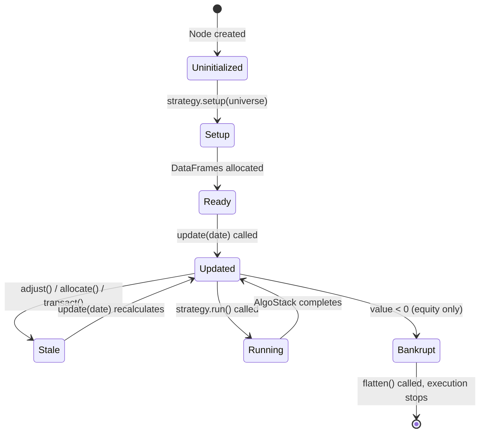
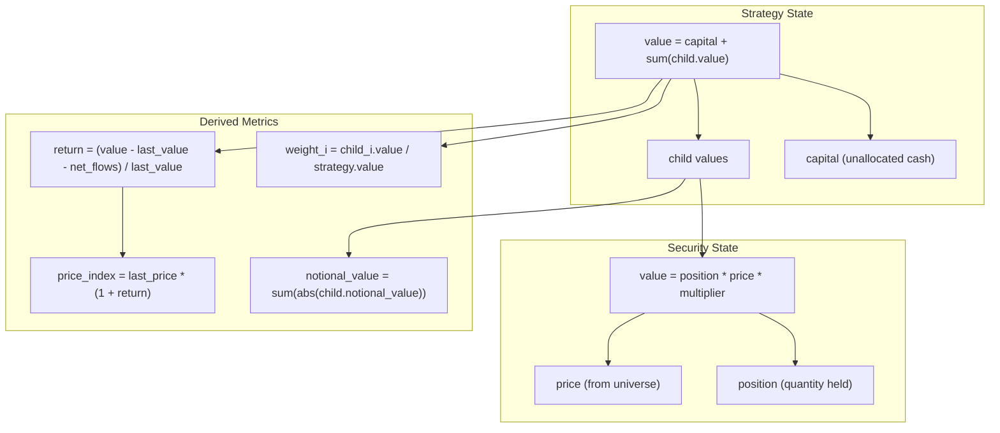
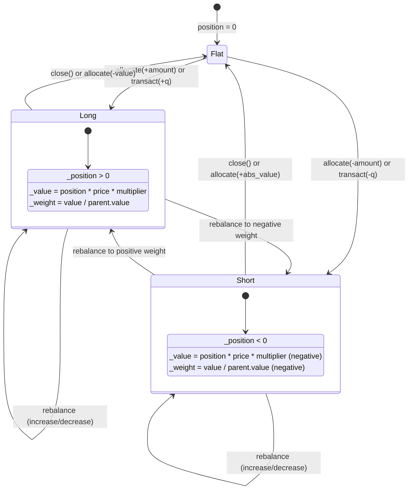
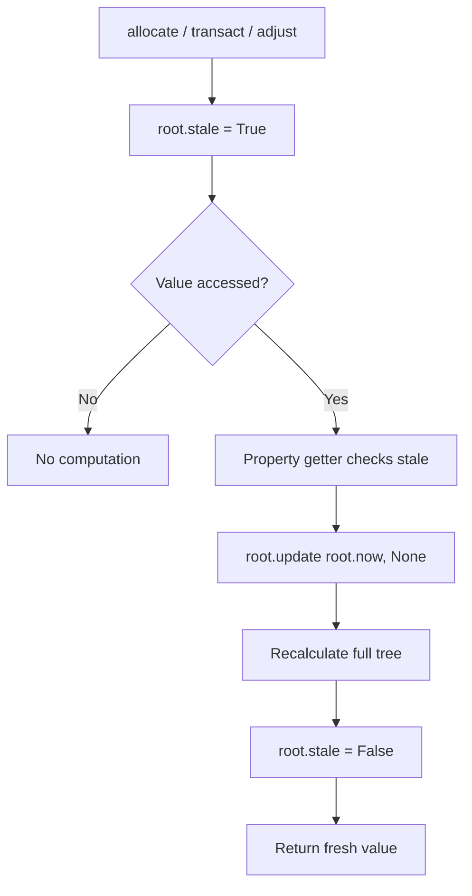

# bt -- State Management

## Overview

This document describes how bt manages state throughout a backtest: the tree node
hierarchy, portfolio state tracking, position lifecycle, and performance metric
computation. Understanding state flow is essential for building custom algos and
debugging strategy behavior.

---

## 1. Node State Hierarchy

Every entity in bt inherits from `Node` (`src/bt/core.py`, line 24). The tree
structure determines how state propagates. The root node owns global state,
while children maintain local state relative to their parent.



### Node State Fields

Each `Node` carries the following state:

| Field | Type | Description |
|-------|------|-------------|
| `_price` | `float` | Current price (index value for strategies, market price for securities) |
| `_value` | `float` | Current total market value |
| `_notl_value` | `float` | Current notional value (for fixed income) |
| `_weight` | `float` | Weight relative to parent |
| `_capital` | `float` | Unallocated cash (strategies only) |
| `now` | `datetime` | Current simulation date |
| `stale` | `bool` | Root-level flag indicating tree needs recalculation |

### Internal DataFrames

During `setup()`, each node allocates internal DataFrames indexed by the
universe date range. These store the full time series:

**StrategyBase** (`core.py`, line 624):
```
data columns: [price, value, notional_value, cash, fees, flows]
              + [bidoffer_paid] if bidoffer tracking enabled
```

**SecurityBase** (`core.py`, line 1365):
```
data columns: [value, position, notional_value, outlay]
              + [price] if prices not in universe
              + [bidoffer_paid] if bidoffer tracking enabled
```

---

## 2. Portfolio State Model

A strategy's complete state at any point in time is determined by its capital
plus the state of all its children. The relationship between these components
forms a conservation equation.



### Value Calculation

The strategy value is computed bottom-up during `update()` (`core.py`, line 692):

```
strategy.value = strategy.capital
for child in children:
    child.update(date)
    strategy.value += child.value
```

For fixed income strategies, notional value uses absolute values:
```
strategy.notional_value = sum(abs(child.notional_value))
```

### Price Index Calculation

The strategy price index represents performance over time, accounting for flows:

**Equity strategies** (multiplicative returns):
```
return = value / (last_value + net_flows) - 1
price  = last_price * (1 + return)
```

**Fixed income strategies** (additive returns):
```
pnl    = value - (last_value + net_flows)
return = pnl / last_notional_value * PAR
price  = last_price + return
```

Where `PAR = 100.0` is the reference price for fixed income strategies.

---

## 3. Position Tracking

Positions are tracked at the `SecurityBase` level. Each security maintains a scalar
`_position` field that changes only through `allocate()` or `transact()` calls.



### Position Update Lifecycle

1. **Idle detection**: If `_position` unchanged and date unchanged, skip update
2. **Price update**: Read new price from universe on date change
3. **Value calculation**: `_value = _position * _price * multiplier`
4. **Outlay recording**: If `_outlay != 0`, record to time series and reset
5. **Need-update flag**: Set to `False` when position and weight are both zero

### Integer vs Float Positions

By default, `integer_positions = True` (set on root, propagated to all children):

- **Long positions**: `q = math.floor(amount / price)` (round down)
- **Short positions**: `q = math.ceil(amount / price)` (round up, toward zero)
- **Close-out**: Exact quantity `q = -position` (no rounding)

Set `integer_positions = False` for strategies with high prices relative to capital,
or when testing with adjusted price series where prices may be artificially large.

---

## 4. Algo State Communication

Algos communicate state through two dictionaries on the strategy: `temp` and `perm`.

### temp (Transient State)

Cleared at the beginning of every `Strategy.run()` call. Used to pass data between
algos within a single execution cycle.

| Key | Set By | Read By | Type |
|-----|--------|---------|------|
| `selected` | `SelectAll`, `SelectN`, `SelectWhere`, ... | `WeighEqually`, `WeighInvVol`, ... | `list[str]` |
| `weights` | `WeighEqually`, `WeighTarget`, ... | `Rebalance`, `LimitWeights`, ... | `dict[str, float]` |
| `stat` | `StatTotalReturn`, `SetStat` | `SelectN` | `pd.Series` |
| `cash` | User-defined algo | `Rebalance` | `float` (0-1) |
| `notional_value` | `SetNotional` | `Rebalance` | `float` |

### perm (Persistent State)

Preserved across `run()` calls. Used by stateful algos that need to track
information over time.

| Key | Set By | Read By | Type |
|-----|--------|---------|------|
| `closed` | `ClosePositionsAfterDates` | `SelectActive` | `set[str]` |
| `rolled` | `RollPositionsAfterDates` | `SelectActive` | `set[str]` |

### State Flow Example

```python
# This pipeline demonstrates state flow through temp:
algos = [
    bt.algos.RunMonthly(),          # Gate: returns True/False
    bt.algos.SelectAll(),            # Sets temp['selected'] = ['AAPL', 'MSFT', ...]
    bt.algos.StatTotalReturn(),      # Sets temp['stat'] = pd.Series of returns
    bt.algos.SelectN(n=5),           # Reads temp['stat'], sets temp['selected'] = top 5
    bt.algos.WeighInvVol(),          # Reads temp['selected'], sets temp['weights']
    bt.algos.LimitWeights(limit=0.3),# Reads/modifies temp['weights']
    bt.algos.Rebalance(),            # Reads temp['weights'], executes trades
]
```

---

## 5. Capital Flow Tracking

Capital movements are tracked through two complementary mechanisms:
flows (which don't affect returns) and adjustments (which do).

### Flow vs Non-Flow Adjustments

The `adjust()` method (`core.py`, line 858) accepts a `flow` parameter:

- **flow=True** (default): Capital injection/withdrawal. Increments `_net_flows`,
  which is subtracted from the denominator when calculating returns. Used by
  `allocate()` when called on a strategy, and by `CapitalFlow` algo.

- **flow=False**: Performance-impacting adjustment. Does NOT increment `_net_flows`.
  Used for commissions, dividends, and inter-strategy allocations.

```
return = (value - last_value - net_flows) / (last_value + net_flows)
```

This ensures that depositing or withdrawing cash does not distort the performance
index, while commissions and dividends are correctly reflected.

### Fee Tracking

Fees are accumulated per period via `_last_fee` and stored in the `fees` time series.
The `adjust()` method accepts an optional `fee` parameter that is tracked separately
from the capital adjustment itself.

---

## 6. Stale State and Lazy Evaluation

The staleness mechanism is central to bt's performance. Rather than recalculating
the entire tree after every operation, bt defers recalculation until a value is
actually accessed.



Properties that check staleness before returning (`core.py`):
- `Node.value` (line 250)
- `Node.weight` (line 269)
- `Node.notional_value` (line 261)
- `StrategyBase.price` (line 412)
- `StrategyBase.prices` (line 422)
- `StrategyBase.fees` (line 467)

Properties that do NOT check staleness (safe to read without update):
- `StrategyBase.capital` (line 449) -- direct field access
- `SecurityBase.position` (line 1260) -- direct field access

---

## 7. Paper Trading State

Sub-strategies maintain a parallel "paper" copy for independent price tracking.
The paper copy has its own complete state and runs independently.

| Attribute | Real Strategy | Paper Copy |
|-----------|---------------|------------|
| `parent` | Parent strategy | Self (root) |
| `_paper_trade` | `True` | `False` |
| `_capital` | 0 (managed by parent) | 1,000,000 (fixed) |
| `_price` | Copied from paper | Calculated normally |
| Children | Shared universe, no own capital | Full independent positions |

During `update()`, if `_paper_trade` is True (line 848 in `core.py`):
```python
self._paper.update(date)
self._paper.run()
self._paper.update(date)
self._price = self._paper.price
```

---

## 8. Bankruptcy State

When a strategy's value drops below zero (equity mode only), it enters bankruptcy:

1. `bankrupt` flag set to `True` (`core.py`, line 749)
2. `flatten()` called -- closes all positions
3. In `Backtest.run()`, the main loop skips `strategy.run()` for bankrupt strategies
4. The strategy continues to be updated (prices recorded) but no new trades execute

Fixed income strategies disable bankruptcy detection since negative values are
normal in that context (e.g., short positions exceeding longs).

---

## 9. Universe and Data State

The universe is the core data source, stored at two levels:

- **`_original_data`**: Full universe DataFrame passed to `setup()`
- **`_universe`**: Filtered copy containing only relevant columns for this strategy
- **`_funiverse`**: Windowed view of `_universe` up to current date (cached)

The `_last_chk` field tracks the last date the windowed view was computed,
avoiding repeated slicing on multiple accesses within the same time step.

Additional data (signals, risk, bid-offer spreads) is stored in `_setup_kwargs`
and accessed via `strategy.get_data('key')` (`core.py`, line 664).

---

## Source File References

| File | State Components | Lines |
|------|-----------------|-------|
| `src/bt/core.py` | `Node` base state fields | 24-331 |
| `src/bt/core.py` | `StrategyBase.update()` -- tree recalculation | 692-856 |
| `src/bt/core.py` | `StrategyBase.adjust()` -- capital / stale flag | 858-888 |
| `src/bt/core.py` | `SecurityBase.update()` -- position/price state | 1421-1483 |
| `src/bt/core.py` | `Strategy.run()` -- temp clearing, algo dispatch | 2097-2107 |
| `src/bt/core.py` | `Algo` / `AlgoStack` -- algo state model | 1985-2057 |
| `src/bt/backtest.py` | `Backtest` -- run state, result collection | 91-368 |

---
## See Also
- [README](README.md) — Project overview and quick start
- [Architecture](architecture.md) — System design and components
- [Workflow](workflow.md) — Event flows and processing pipelines
- [Development](development.md) — Development guide and best practices
