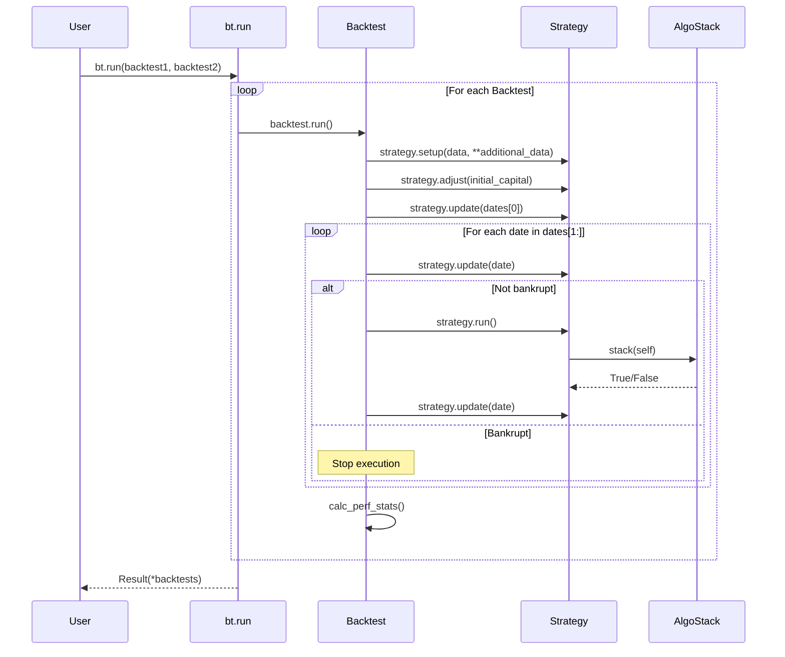
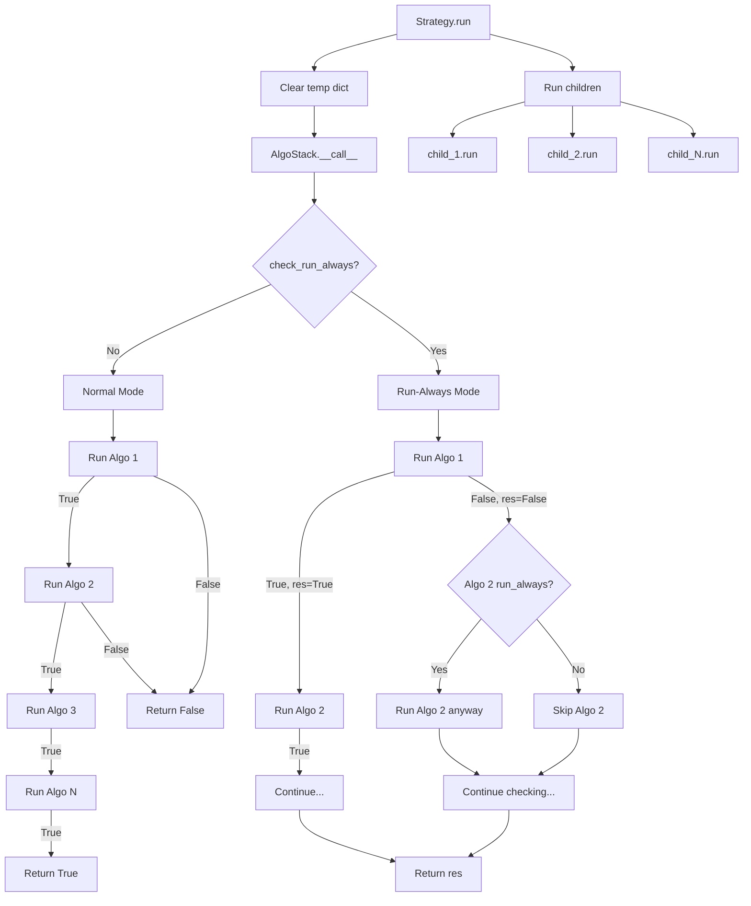
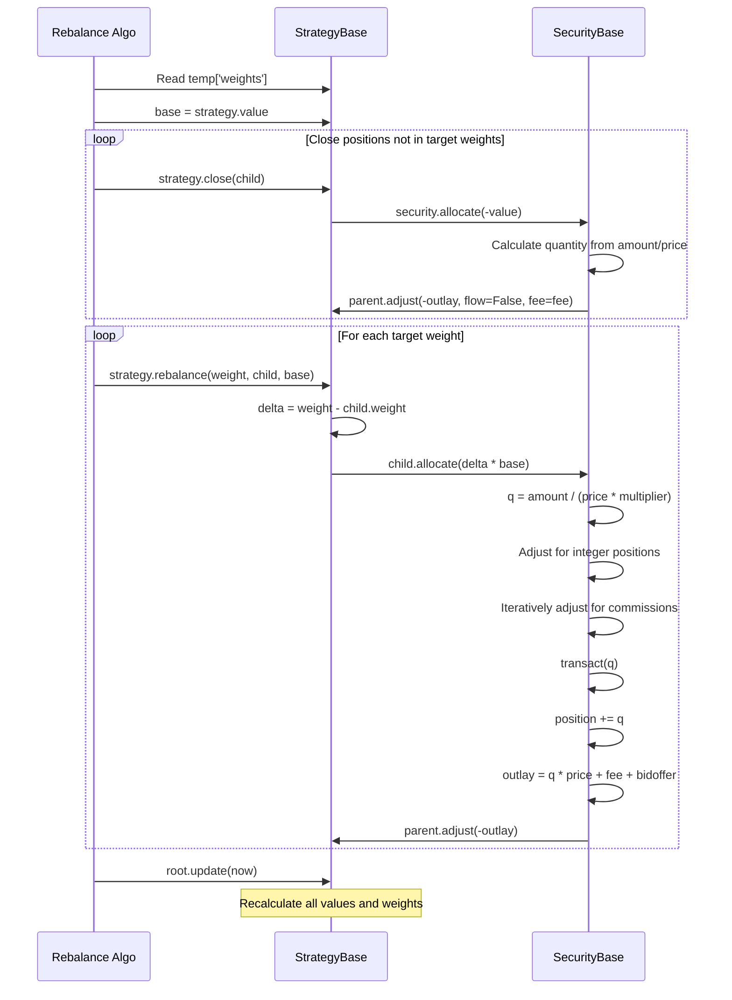
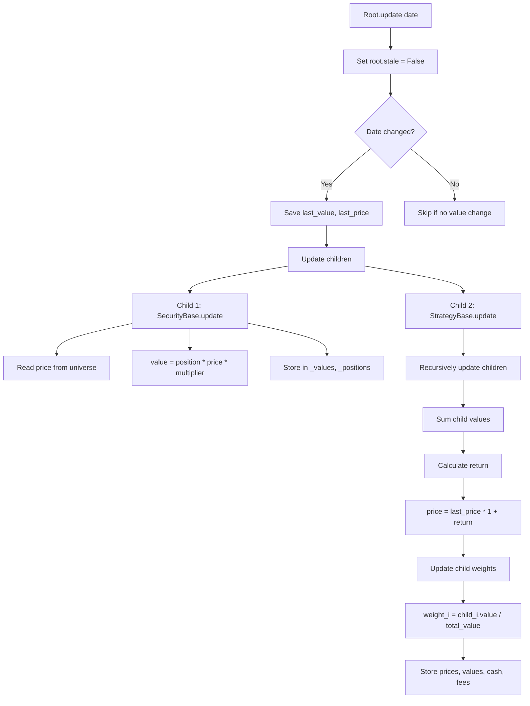
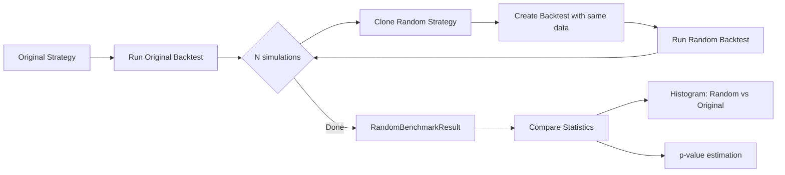

# bt -- Workflow & Event Flows

## Overview

This document describes the major workflows in the bt backtesting framework: how a backtest
executes, how strategies evaluate their algorithm stacks, and how orders flow through
the tree structure to produce fills.

---

## 1. Backtest Execution Flow

The top-level entry point is `bt.run()` in `src/bt/backtest.py`. It accepts one or more
`Backtest` objects, runs each in sequence, and returns a `Result`.



### Phase Details

**Initialization** (`Backtest.__init__`, line 148 in `backtest.py`):
- Deep copies the strategy to allow reuse
- Prepends a NaN row at `t0 - 1 day` for clean starting reference
- Aligns `additional_data` DataFrames to the same extended index
- Sets commission function if provided

**Setup** (`StrategyBase.setup`, line 563 in `core.py`):
- Filters universe to relevant tickers based on child definitions
- Creates internal DataFrames for prices, values, cash, fees, flows
- Recursively sets up all child nodes (strategies and securities)
- If the strategy is a sub-strategy (not root), creates a paper-trade clone

**Main Loop** (`Backtest.run`, line 226 in `backtest.py`):
- Iterates over every date in the data index
- Calls `update()` to refresh all prices and values from market data
- Calls `run()` to execute strategy logic (the AlgoStack)
- Calls `update()` again to persist results after trades

---

## 2. Strategy Tree Evaluation Flow

When `strategy.run()` is called, it triggers the AlgoStack which processes algos
sequentially. Each algo receives the strategy as `target` and returns a boolean.
Execution halts on the first `False` unless an algo has the `run_always` attribute.



### Typical Algo Pipeline

A standard strategy uses algo stacks in a pipeline pattern. Algos communicate
via the `target.temp` dictionary (cleared each `run()` call) and `target.perm`
dictionary (persists across calls).

| Stage | Example Algos | temp Keys |
|-------|---------------|-----------|
| **Timing** | `RunMonthly`, `RunWeekly`, `RunOnDate` | _(gates execution)_ |
| **Selection** | `SelectAll`, `SelectN`, `SelectMomentum` | `selected` |
| **Weighting** | `WeighEqually`, `WeighInvVol`, `WeighERC` | `weights` |
| **Constraints** | `LimitWeights`, `LimitDeltas`, `TargetVol` | `weights` (modified) |
| **Execution** | `Rebalance`, `RebalanceOverTime` | _(reads `weights`)_ |

Example:
```python
algos = [
    bt.algos.RunMonthly(),       # returns True on month boundary
    bt.algos.SelectAll(),         # sets temp['selected']
    bt.algos.WeighEqually(),      # sets temp['weights'] from selected
    bt.algos.Rebalance(),         # reads temp['weights'], executes trades
]
strategy = bt.Strategy('equal_weight', algos)
```

---

## 3. Order Execution Flow (Rebalance)

The `Rebalance` algo (line 1754 in `algos.py`) reads target weights from `temp['weights']`
and calls `strategy.rebalance()` for each child. This triggers a chain of calls
through the tree that ultimately adjusts security positions.



### Capital Allocation Detail

When `SecurityBase.allocate(amount)` is called (line 1486 in `core.py`):

1. **Quantity calculation**: `q = amount / (price * multiplier)`
2. **Integer rounding**: `math.floor(q)` for longs, `math.ceil(q)` for shorts
3. **Commission loop**: Iteratively reduces `q` until `outlay <= amount`
4. **Position update**: `self._position += q`
5. **Parent adjustment**: `parent.adjust(-full_outlay, flow=False, fee=fee)`

The parent's `adjust()` method (line 858 in `core.py`) modifies `_capital` and
marks the tree as stale, triggering a lazy recalculation on the next access.

---

## 4. Update Propagation Flow

The `update()` method propagates through the tree from root to leaves, refreshing
prices, values, and weights. It uses a staleness flag to avoid redundant computation.



### Stale Flag Mechanism

The `root.stale` flag is a key optimization:

- **Set to True**: When `adjust()` is called (capital changes, trades executed)
- **Checked on access**: Properties like `value`, `weight`, `price` check staleness
- **Cleared by update**: `update()` sets `root.stale = False` at the start

This means values are only recalculated when actually needed, not after every
intermediate operation during a rebalance.

---

## 5. Optimization / Random Benchmark Flow

The `benchmark_random()` function (line 42 in `backtest.py`) provides statistical
validation by comparing a strategy against many random variants.



Usage:
```python
random_strategy = bt.Strategy('random', [
    bt.algos.RunMonthly(),
    bt.algos.SelectAll(),
    bt.algos.SelectRandomly(n=5),   # random selection component
    bt.algos.WeighRandomly(),        # random weighting component
    bt.algos.Rebalance(),
])

result = bt.benchmark_random(original_backtest, random_strategy, nsim=100)
result.plot_histogram(statistic='monthly_sharpe')
```

---

## 6. Fixed Income Workflow

Fixed income strategies use a fundamentally different workflow where notional values
replace market values for weighting purposes, and `transact()` replaces `allocate()`
for position sizing.

| Aspect | Standard Strategy | Fixed Income Strategy |
|--------|-------------------|----------------------|
| Weights based on | `value` (market value) | `notional_value` (position size) |
| Position entry | `allocate(amount)` | `transact(quantity)` |
| Price calculation | Multiplicative returns | Additive PnL / notional |
| Bankruptcy | Detected at value < 0 | Disabled (model explicitly) |
| Initial capital | Required | Not used |
| Rebalance base | `strategy.value` | `strategy.notional_value` |

The `SetNotional` algo (line 1726 in `algos.py`) controls the target notional
that `Rebalance` uses as its base for fixed income strategies.

---

## 7. Paper Trading Mechanism

Sub-strategies (children of the root) automatically use paper trading to compute
their own price index without requiring actual capital allocation from the parent.

During `setup()` (line 580 in `core.py`):
1. A deep copy of the sub-strategy is created (`self._paper`)
2. The copy is set up independently with a fixed paper amount (1,000,000)
3. On each `update()`, the paper copy runs its own logic
4. The parent strategy reads the paper copy's price for its own records

This allows sub-strategies to have independent performance tracking while the
parent handles actual capital allocation based on relative performance.

---

## Source File References

| File | Key Functions | Lines |
|------|---------------|-------|
| `src/bt/backtest.py` | `run()`, `Backtest.run()`, `Result` | 17-617 |
| `src/bt/core.py` | `StrategyBase.update()`, `.run()`, `.rebalance()` | 692-1034 |
| `src/bt/core.py` | `SecurityBase.allocate()`, `.transact()` | 1486-1684 |
| `src/bt/algos.py` | `Rebalance`, `RebalanceOverTime` | 1754-1893 |
| `src/bt/algos.py` | `RunMonthly`, `SelectAll`, `WeighEqually` | 233-984 |

---
## See Also
- [README](README.md) — Project overview and quick start
- [Architecture](architecture.md) — System design and components
- [State Management](state-management.md) — State lifecycle and data models
- [Development](development.md) — Development guide and best practices
